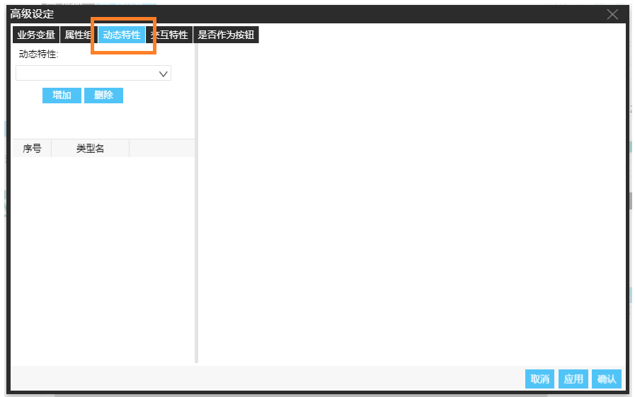
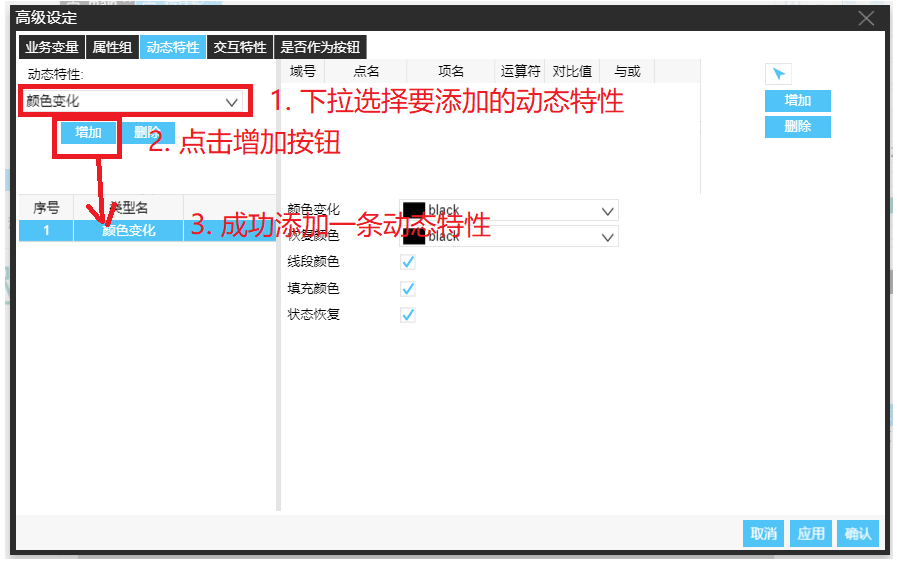
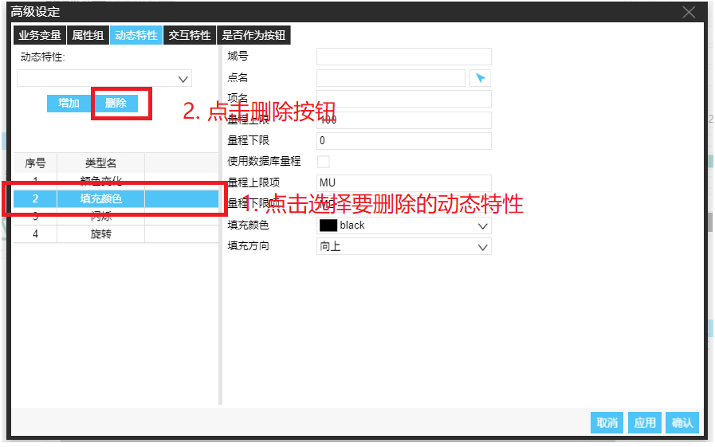
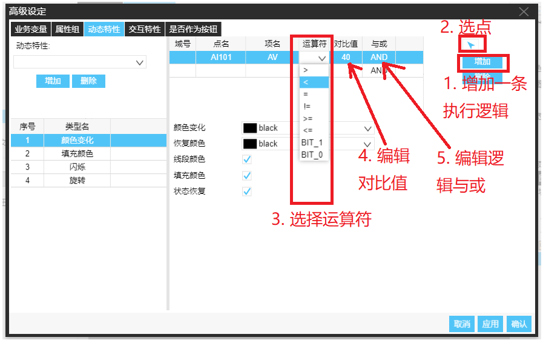
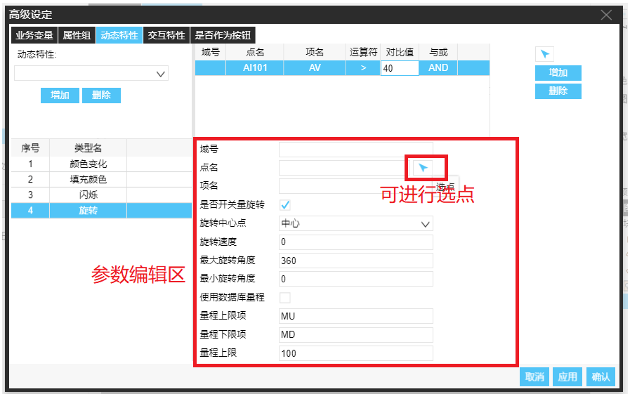

打开动态特性编辑窗口：
右键对象，选择配置，在弹框里选择动态特性选项卡。如下图

* 添加动态特性
  1. 下拉框选择所要增加的动态特性
  2. 点击添加完成添加
  3. 下方动态特性列表显示已添加的动态特性

  如下图：

* 删除动态特性
  1. 在动态特性列表选择要删除的动态特性
  2. 点击删除按钮完成删除
  3. 动态特性列表更新

  如下图：

* 编辑动态特性
  1. 在动态特性列表选择要编辑的动态特性
  2. 在右侧动态特性详细窗口进行动态特性详情编辑
  3. 动态特性详情编辑-执行条件编辑
    * 点击增加按钮新增一条执行条件
    * 点名项名可直接编辑，也可点击增加按钮上方的选点按钮进行选点
    * 运算符为下拉选择形式
    * 对比值作为该点值及运算符对比，当条件满足该条逻辑为真
    * 与或表示该条执行逻辑与下一条执行逻辑关系

    如下图：

上图表示： 该条逻辑为 AI101.AV 值与 40 进行逻辑对比

  4. 动态特性详情编辑-参数编辑
    * 参数编辑在执行条件下方，可直接进行编辑
    * 某些动态特性如 "旋转", 参数提供点项名编辑，此时点名最后的选点按钮可进行便捷选点操作

    如下图：

