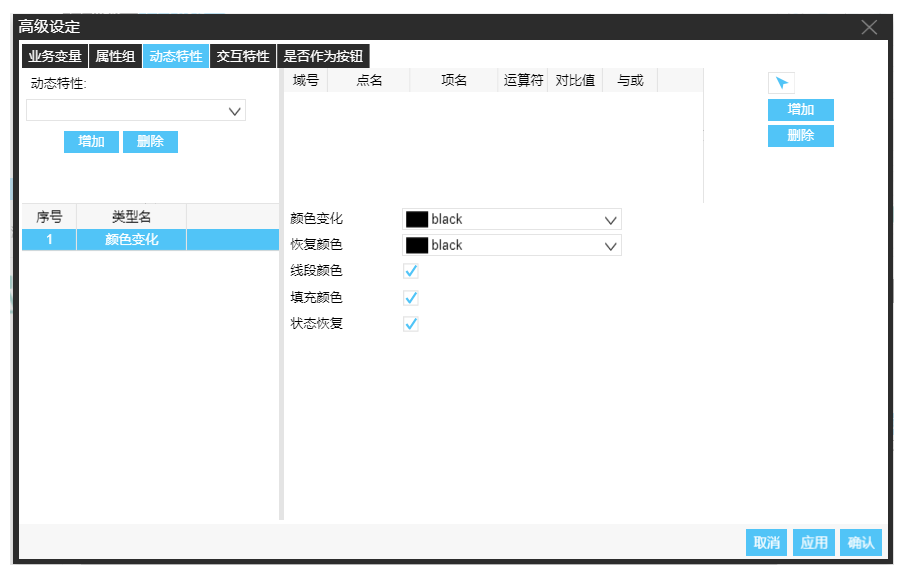

　　动态特性即是用图形、数字或者动画方式，来表现数据库中点值的变化。例如现场测量值的数值显示，设备的启停状态等。
　　切换到“动态特性”选项卡中，通过左侧下拉框选择要添加的动态特性。右侧窗口显示该对象的各个动态特性的相应的参数编辑窗口，未添加任何特性时显示为空。可以为一个对象添加多种动态特性，多个动态特性在左侧下方以表格形式显示，单击选项卡名称进行相应的特性参数窗口的切换。

　　动态特性编辑窗口示例如下

　　详细了解动态特性请前往:

　　1.  [添加删除及编辑动态特性](动态特性-添加删除及编辑.md)
  
<!-- 　　２. [符号属性定义示例](符号属性定义示例.md) -->
