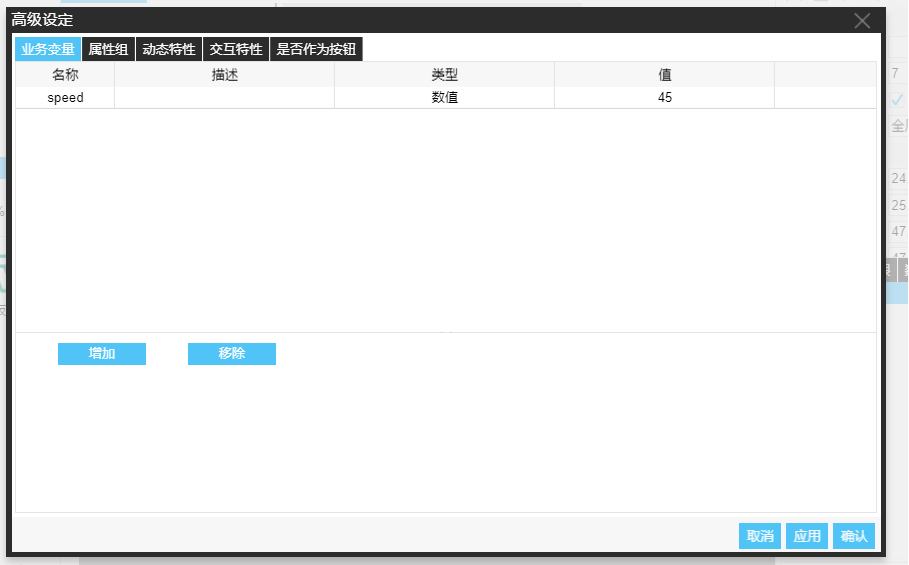
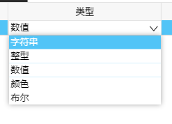
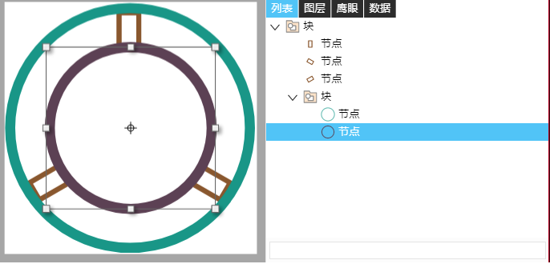
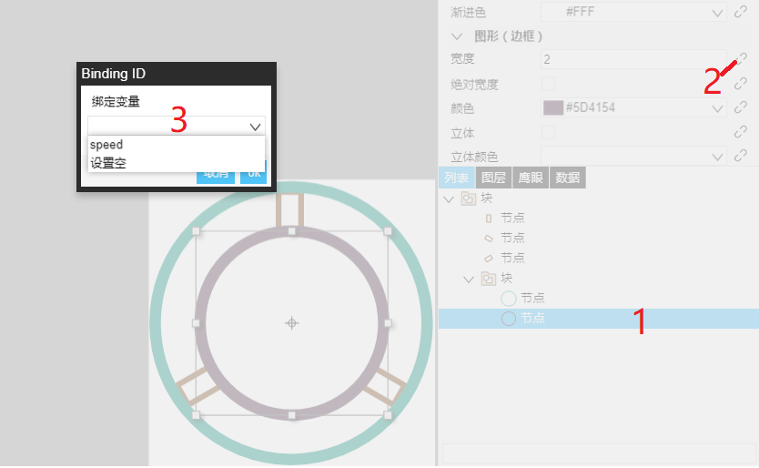
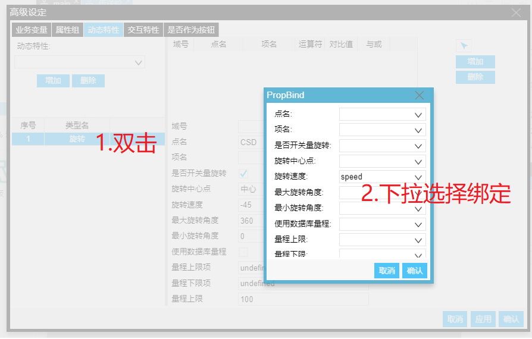
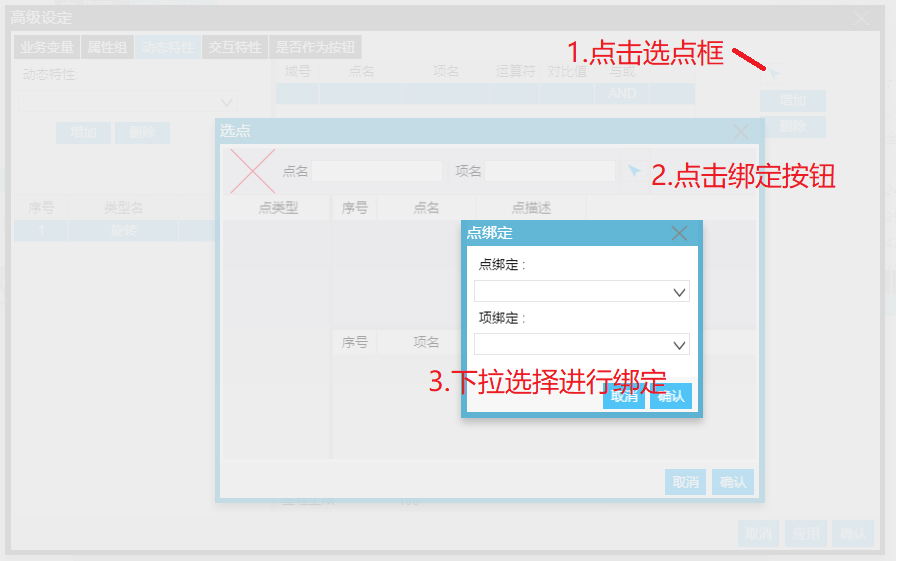

　　例如：一个组合对象，或者任何基本图形，可以把图形或子图元各自的边框宽度属性集合起来作为一个符号属性，名称为“矩形、椭圆填充颜色”。该组合对象添加属性定义，主要步骤如下：

1. 定义属性
右键组合对象，选择配置项，在弹出窗口选择业务变量，如下图

  * 添加属性：单击"增加"按钮，属性表格会出现空行，直接双击空行可进行编辑，请勿支属性名称为空，否则属性不记

  * 修改属性：直接双击属性表格，可对符号属性进行编辑

  * 删除属性： 选中要删除的属性，点击"删除"按钮可对该属性删除

2. 属性编辑：双击属性表格，可对属性直接进行编辑：
  * 名称：为后面使用的属性名称，限制为合法英文字符串
  * 描述：属性的描述，方便使用时知道属性定义意义

  * 类型：提供以下几种类型
<!-- 

 -->
  

    - 字符串：可供所有绑定需要的字符串使用
    - 整型：限定数值为整数
    - 数值: 不限数值类型
    - 颜色：可选取一个颜色拱所有颜色类型值使用
    - 布尔：该类型值只有两种，一种为true，一种为false

  * 值：为该属性默认值，如不给符号赋值，则使用默认值

3. 属性绑定
  * 绑定静态样式
    1. 在编辑器右下方列表试图选取要绑定的子图元

    2. 在上方图元静态属性区找到要绑定的属性，点击后面的标签按钮，然后在弹框中选择要绑定的属性

    3. 在使用符号的地方给符号该属性赋值，运行态画面就会显示出绑定之后的样式
  * 绑定动态特性
    1. 绑定动态特性属性：打开图元动态属性编辑框，双击左侧动态属特性列表可对选定动态特性的某条特性进行绑定

    2. 绑定动态特性逻辑：想对某动态特性逻辑条件的点名及项名进行绑定，单击需要绑定的逻辑条件然后单击选点按钮，然后单机弹框的绑定按钮，对点名及项名进行选择绑定

  * 绑定交互特性，方式和绑定动态特性相同