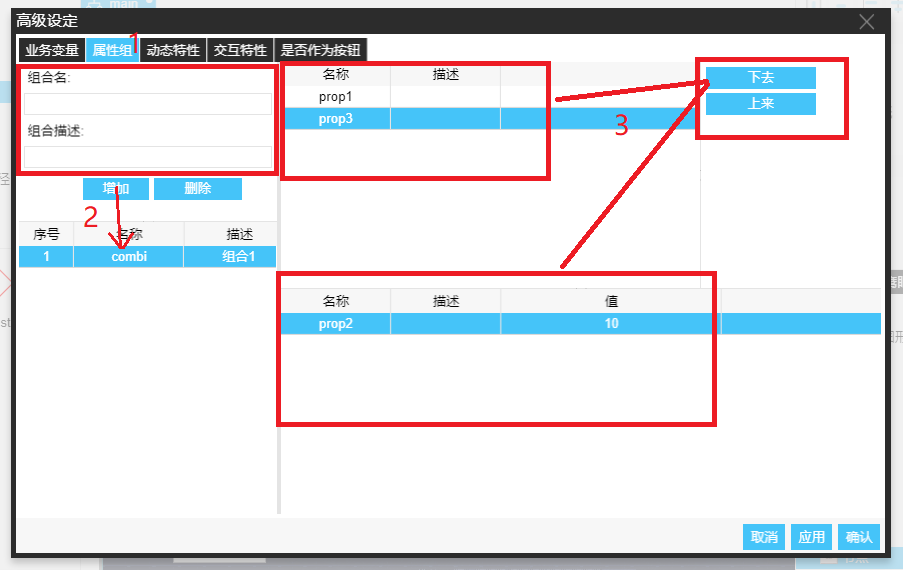

　　配方定义描述了图形对象符号属性的的一个状态集合，也可以只包括一个符号属性。

　　主要目的是为图形对象提供一些标准状态，如按钮的按下或者抬起状态等。这样，当需要对其进行状态转换的时候，就可以直接从库中找到这些标准配方使用，而不需要一点点地修改图形对象的子对象的状态了。下面以组合对象为例说明配方属性定义的操作步骤。

　　增加及编辑属性组如下：

1. 右键对象，选择配置，在弹框里选择属性组。如下图

2. 键入组合名（必需），组合描述（非必需），点击增加按钮，可新增一个属性组

3. 右侧属性组操作列表分两部分组成，上方是对象自定义过的属性(见 [符号属性定义](符号属性定义.md))，下方是该该属性组包含的属性，可以在上方点击添加和删除按钮编辑该属性组

总步骤如下图：

